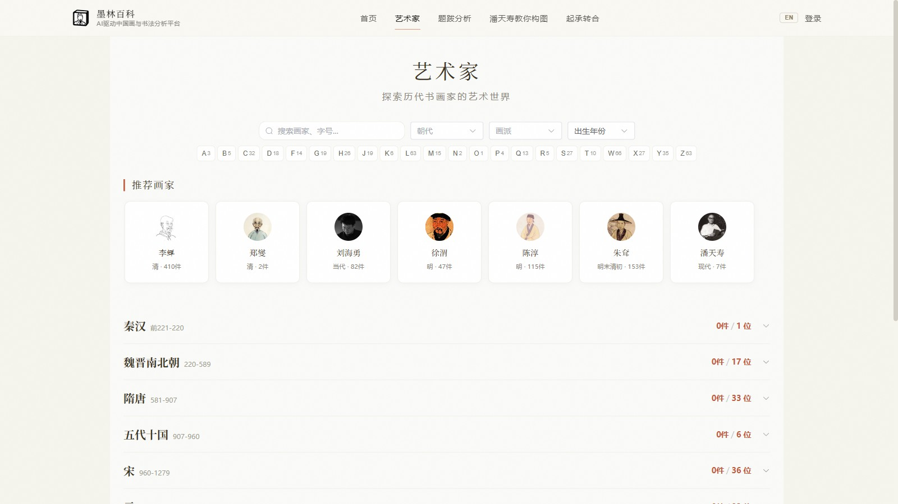
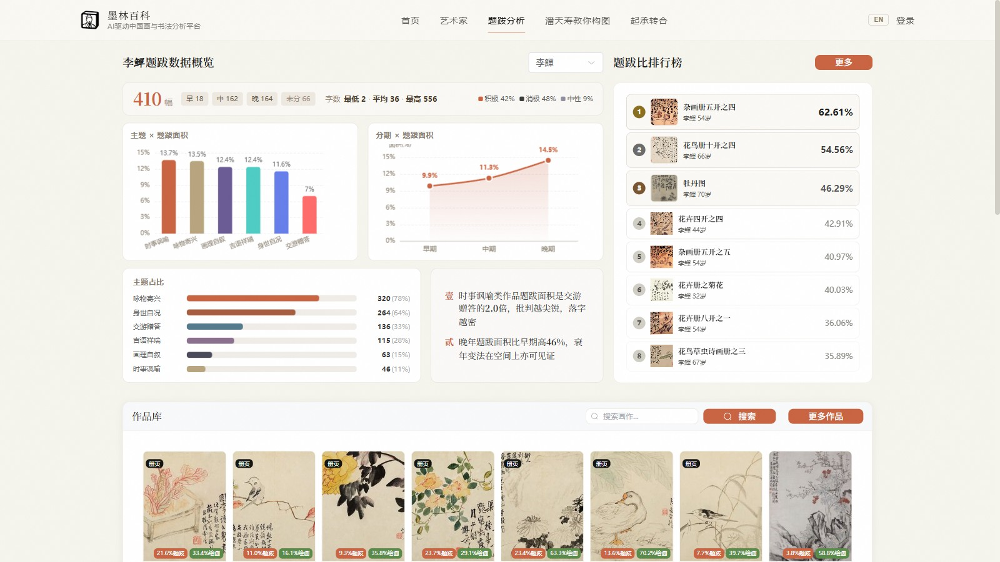
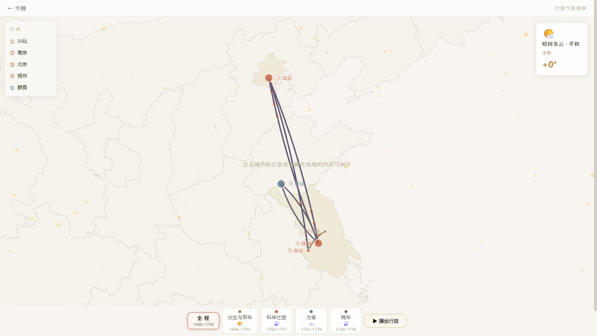

# 墨林百科 (Molin Wiki)

**AI 驱动的中国书画知识平台** — 集艺术家百科、作品收录、题跋分析、书法溯源、构图讲评与知识检索于一体。

**AI-Powered Chinese Painting & Calligraphy Knowledge Platform** — Artist encyclopedia, artwork collection, colophon analysis, calligraphy recognition, composition critique, and semantic knowledge retrieval.

[](https://github.com/zaxchou/molin-wiki/actions/workflows/test.yml)


🌐 **在线访问 / Live**: [molin.wiki](https://molin.wiki)

---

## Screenshots / 截图

**艺术家百科** — 按朝代浏览历代书画家，含生卒、生平、作品与印章档案
**Artist Encyclopedia** — browse masters by dynasty, with biographies, artworks, and seals



**题跋分析** — AI 识别题跋/绘画/留白空间，生成数据概览、排行榜与名家对比
**Colophon Analysis** — AI segments colophon/painting/blank space into stats, rankings, and master comparisons



**行旅气象地图** — 画家一生游历轨迹，按人生分期播放，叠加持作年份与当地气象
**Travel Map** — an artist's lifetime journeys, playable by life period, annotated with creation years and local weather



---

## Features / 功能模块

### 艺术家百科 / Artist Encyclopedia
历代书画名家的生平、作品、印章、题跋、游历与艺术风格档案，支持朝代/画派/生卒年筛选与 A–Z 索引。
Life stories, artworks, seals, colophons, and stylistic profiles of historical masters — filterable by dynasty, school, and years, with an A–Z index.

### 题跋空间分析 / Colophon (Tiba) Analysis
AI 自动识别画作中的题跋、绘画、留白区域，生成空间分析图；题跋主页提供数据概览（分期统计、主题占比、情感分布）、题跋比排行榜与名家对比。
AI segments colophons, paintings, and blank space; the dashboard renders period stats, theme share, sentiment distribution, a colophon-ratio ranking, and side-by-side master comparison.

### 书法识别 / Calligraphy Recognition
上传单字图片，AI 智能匹配碑帖字形来源，返回相似度排名与候选列表。
Upload a character image — AI matches it against rubbing database sources with similarity ranking.

### 潘天寿构图讲评 / Pan Tianshou Composition Critique
基于潘天寿教学理论，异步分析国画构图特征，生成讲评报告与 PDF（含热力图、起承转合分析）。
Asynchronous composition analysis based on Pan Tianshou's theory — critique reports with heatmaps, qi-cheng-zhuan-he structure analysis, and PDF export.

### 知识语义搜索 / Knowledge Semantic Search
基于 Qdrant 向量检索，支持对题跋、印章、绘画理论进行自然语言搜索，并配备 AI 小墨聊天助手。
Vector-based semantic search over colophons, seals, and painting theory — with AI chat assistant "Xiao Mo".

### 行旅气象地图 / Travel Weather Map
以地理信息呈现画家的游历轨迹与创作分布，按「出生与早年 / 科举仕途 / 为官 / 晚年」等人生分期切换或连续播放。
Geographic visualization of an artist's journeys and creative output — switch or play through life periods.

### 情感分析引擎 / Emotion Engine
多维度情感/意境分析，为画作生成情感卡片与可视化雷达图。
Multi-dimensional sentiment & mood analysis — emotion cards and radar charts for artworks.

### 印鉴管理 / Seal Management
管理艺术家印鉴库，支持多版本合并、缩略图展示与检索。
Artist seal library with version merging, thumbnails, and search.

### 中英双语 / Bilingual UI
全站中英一键切换；艺术家名、作品名、朝代、分期标签等数据级内容由后台自动翻译并缓存，增量更新。
One-click zh/EN switch across the whole site; data-level content (artist names, artwork titles, dynasties, period labels) is auto-translated in the background and cached.

### 用户与权限 / User & Permissions
5 级 RBAC：`super_admin` / `admin` / `editor` / `reader` / `guest`，JWT 登录，操作审计。浏览与检索对匿名访客开放，上传/校对/AI 批量分析需编者权限。
5-tier RBAC with JWT auth and audit logging. Browsing is open to anonymous visitors; upload/verify/batch AI analysis requires editor roles.

---

## Tech Stack / 技术栈

| Layer | Technology |
|-------|-----------|
| **Frontend** | Vue 3 + Vite + Element Plus + OpenSeadragon |
| **Backend** | FastAPI + SQLAlchemy (SQLite) |
| **Async Tasks** | Celery + Redis (composition analysis, batch processing) |
| **Vector Search** | Qdrant (semantic search, composition case retrieval) |
| **AI / LLM** | SiliconFlow API, Qwen/DashScope (OpenAI-compatible) |
| **Deep Zoom** | OpenSeadragon (DZI tiles for high-res scrolls) |
| **Deployment** | Docker (nginx:alpine + Python) on Ubuntu, SCP-based deploy |

---

## Project Structure / 目录结构

```
molin-wiki/
├── backend/
│   ├── app/
│   │   ├── api/              # Routes (artists, artworks, tiba, content-analysis, knowledge...)
│   │   ├── core/             # Config, database, auth, Celery
│   │   ├── models/           # SQLAlchemy models
│   │   ├── modules/          # Feature modules (composition, etc.)
│   │   └── services/         # Business services (AI analysis, translation cache...)
│   ├── tests/                # Contract tests (pytest)
│   └── data/                 # SQLite, uploads, DZI tiles (gitignored)
├── frontend/
│   ├── src/
│   │   ├── views/            # Page components
│   │   ├── locales/          # zh / EN dictionaries
│   │   └── modules/          # Feature modules
│   └── scripts/              # i18n checks & utility scripts
├── deploy/                   # Nginx config, migration scripts
├── deploy.sh                 # One-command deploy (SCP)
├── start_all.sh              # One-command local startup (Linux/macOS)
└── stop_all.sh
```

---

## Local Development / 本地开发

### Prerequisites / 前置要求
- Python 3.10+（生产环境 3.12 / production runs 3.12）
- Node.js 18+
- Redis（可选，仅构图异步分析需要 / optional, only for async composition analysis）

### One-Command Start / 一键启动

**Linux / macOS:**
```bash
chmod +x start_all.sh && ./start_all.sh        # Qdrant → Redis → Celery → FastAPI
./start_all.sh --skip-fastapi                  # 只启动基础设施 / infra only
```

### Manual Start / 手动启动

```bash
# Backend
cd backend
pip install -r requirements.txt
python -m uvicorn app.main:app --reload --host 0.0.0.0 --port 8001

# Frontend (in another terminal)
cd frontend
npm install
npm run dev -- --host 0.0.0.0 --port 8080
```

| Service | URL |
|---------|-----|
| Frontend | `http://localhost:8080` |
| FastAPI Backend | `http://localhost:8001` |
| API Docs (Swagger) | `http://localhost:8001/docs` |
| Redis | `localhost:6379` |

### Tests / 测试

```bash
cd backend
pytest -q        # 契约测试 / contract tests
```

### Environment Variables / 环境变量

参见 `backend/.env.example` 与 `backend/app/core/config.py`。常用配置 / key settings:

- `SILICONFLOW_API_KEY` — 题跋分析 / 书法识别 AI
- `QWEN_API_KEY`（或 `DASHSCOPE_API_KEY`）/ `QWEN_BASE_URL` — 构图讲评 LLM
- `QDRANT_URL` / `QDRANT_API_KEY` — 向量检索
- `REDIS_URL` — Celery broker/backend
- `BAIDU_OCR_API_KEY` / `BAIDU_OCR_SECRET_KEY` — OCR

---

## Deployment / 部署

服务器不连 GitHub，唯一部署入口是本地 SCP 脚本 / the server has no git checkout — deployment is a local SCP script only:

```bash
bash deploy.sh          # 全部站点 / all sites
bash deploy.sh wiki     # 仅 molin.wiki / molin.wiki only
bash deploy.sh anki     # 仅背字帖 / zi2anki only
```

脚本自动构建前端 → SCP 上传 → 重启后端容器并做健康检查。代码改动无需重建镜像（Docker volume 热挂载）。
The script builds the frontend, uploads via SCP, restarts the backend container, and runs a health check. Code changes need no image rebuild (Docker volume hot-mount).

Production: Ubuntu + Docker (nginx:alpine + Python 3.12)。

---

## FAQ

**数据存在哪里？/ Where is data stored?**
作品图片与 SQLite 数据库在服务器本地磁盘（`backend/data/`），向量在 Qdrant。GitHub 仓库只保存源码，不含数据。
Artwork images and the SQLite database live on the server (`backend/data/`), vectors in Qdrant. The GitHub repo contains source code only.

**必须登录才能用吗？/ Is login required?**
浏览、检索、看分析结果都不需要。上传、校对、批量 AI 分析需要编者及以上角色。
Browsing and searching are open to everyone. Uploading, verifying, and batch AI analysis require editor roles.

**如何新增画家或作品？/ How to add artists or artworks?**
登录后进入管理后台（右上角「登录」），支持单件上传与批量导入。
Log in via the top-right button, then use the admin panel — single upload and batch import are both supported.

---

## License

[MIT](LICENSE)

---

## Contact / 联系方式

- Website: [molin.wiki](https://molin.wiki)
- Issues: [GitHub Issues](https://github.com/zaxchou/molin-wiki/issues)
