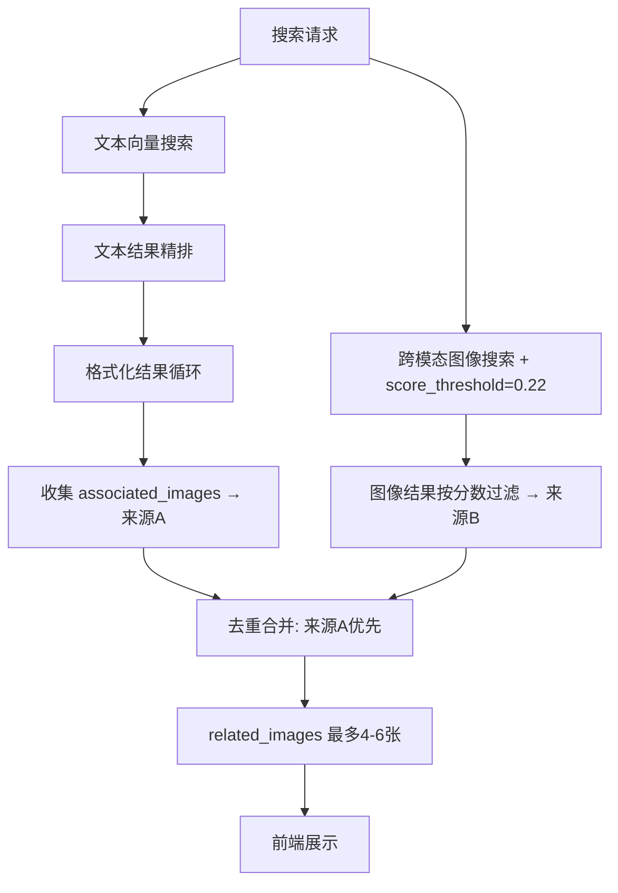

## 用户需求

搜索"合掌"等关键词时，AI概述下方的"相关配图"展示4张图与搜索词完全无关。

## 产品概述

知识库语义搜索功能中，AI概述区域展示的相关配图关联性差，需要改进图片选取逻辑，使配图与搜索关键词有明确的语义关联。

## 核心功能

- 相关配图优先从文本搜索结果的`associated_images`（编辑关联、高相关性）聚合
- 跨模态向量搜索结果加分数门槛过滤噪声
- 去重合并两种来源，associated_images 优先排列
- 前端相关配图卡片改用 display_label 展示标签

## Tech Stack

- 后端：Python / FastAPI / SQLAlchemy / Qdrant（现有项目栈）
- 前端：Vue 3 / Vite（现有项目栈）

## Implementation Approach

### 问题根因

当前 `related_images` 的生成逻辑（L1057-1100）仅从 `search_results` 中筛选 `type` 为图像类型的记录。这些图像来自跨模态向量搜索，其余弦分数正常范围仅 0.19-0.23，无任何分数门槛，导致大量噪声图直接展示。同时，文本搜索结果的 `associated_images`（由 PDF 解析时建立的编辑关联，与文本语义高度相关）完全未被用于 `related_images`。

### 修复策略

**优先级：associated_images（高相关性）> 跨模态搜索（需分数门槛）**

1. **主要来源**：在格式化搜索结果的循环中（L862-1034），从 top 文本结果的 `associated_images` 聚合图像，最多收集 4 张。这些图像与搜索命中的文本块是编辑关联的，语义相关性最强。
2. **次要来源**：跨模态搜索结果加 `score_threshold=0.22`，仅当主要来源不足 4 张时补充。
3. **去重合并**：以 `stored_url`/`url` 去重，associated 优先排列。
4. **前端展示**：相关配图卡片改用 `display_label` 替代 `artist + artwork_title` 的拼接逻辑。

### 性能考虑

- associated_images 已在格式化循环中从 DB 加载（L969-971），只需额外收集，无额外 DB 查询
- 跨模态搜索已有，仅加分数门槛，不增加计算量
- 去重基于 URL set，O(n) 线性复杂度

## Implementation Notes

- `search_collection` 的 `score_threshold` 参数已存在（L172），只需在 L765-768 调用时传入
- associated_images 的格式为 `{"id", "file_name", "stored_url", "page", "figure_id", "caption", "display_label"}`，而 related_images 的格式为 `{"url", "figure_id", "artist", "artwork_title", "era", "description", "score", "display_label"}`，需做字段映射（`stored_url` → `url`）
- 前端 `KnowledgeSearch.vue` L106-109 使用 `img.artist` + `img.artwork_title` 展示标签，associated_images 无这些字段但有 `display_label`，需改为优先使用 `display_label`

## Architecture Design



## Directory Structure

```
backend/app/modules/pantianshou_composition/
├── knowledge_api.py  # [MODIFY] 修复 related_images 关联性
│   ├── L765-768: 跨模态搜索加 score_threshold=0.22
│   ├── L862-1034: 格式化循环中收集 top 文本结果的 associated_images
│   └── L1057-1100: 重写 related_images 提取逻辑（来源A优先 + 来源B补充 + 去重）
│
frontend/src/views/
├── KnowledgeSearch.vue  # [MODIFY] 相关配图卡片标签改用 display_label
│   └── L106-109: img.artist/artwork_title → img.display_label
```