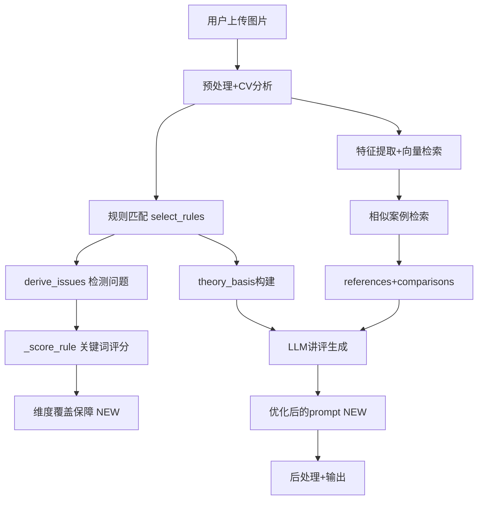

## 产品概述

优化潘天寿构图分析模块的讲评准确性，采用保守方案（不改动检索架构），重点提升三个方面：LLM讲评prompt质量、规则匹配维度覆盖保障、规则库内容扩充。

## 核心功能

- **Prompt优化**：重构 composition_llm.py 的讲评prompt，增加构图类型识别引导、审美判断框架、画材类型感知，使LLM讲评更专业更有针对性
- **规则匹配维度覆盖保障**：改进 select_rules() 算法，确保7个维度各有至少1条规则被选中，避免维度分析空洞
- **规则库扩充**：在 panplus.md 中新增"经典构图范式"规则条目（之字形、对角线、三段式、S形等），丰富规则覆盖面
- **LLM温度微调**：将 temperature 从0.4提高到0.5，增加讲评的创造性表达

## 技术栈

- 后端：Python（现有项目，FastAPI + Qdrant + Qwen API）
- 规则库：Markdown 文件解析（pan.md + panplus.md）
- LLM：Qwen API（兼容 OpenAI 格式）

## 实现方案

### 1. Prompt 重构（composition_llm.py）

当前prompt问题诊断：

- 缺乏"构图类型识别"引导，LLM不知道面对的是什么类型的构图
- 缺乏"审美判断框架"，导致讲评偏机械，像在填表而非在赏析
- 输入数据中 theory_basis 已包含7维度规则，但prompt未引导LLM按维度对号入座
- temperature=0.4 偏低，讲评语感偏生硬

优化策略：

- 在prompt中增加"构图类型识别"步骤，引导LLM先判断画面属于何种构图范式
- 增加"审美判断框架"段落：要求LLM从整体→局部→细节的层次推进分析
- 强化维度-规则对号入座：明确要求每个维度分析必须引用对应的 theory_basis 条目
- temperature 调整为 0.5
- 优化输出结构：概述→构图类型判断→分项分析→评分表→精进建议→结语

### 2. 规则匹配维度覆盖保障（rule_matcher.py）

当前问题：`select_rules()` 纯按 `_score_rule()` 分数排序取 top12，可能导致某些维度（尤其权重低的穿插结构、边角空间）无规则被选中。

优化策略：

- 在 `select_rules()` 中增加"维度覆盖保障"机制：7个维度（KH/XS/SM/QS/FZ/JH/CC/BJ）各至少保证1条规则
- 实现方式：先按分数排序取 top12，再检查维度覆盖，对缺失维度从该维度全部规则中取分数最高的补入
- 保持现有的 panplus 最少2条保底逻辑

### 3. 规则库扩充（panplus.md）

新增"经典构图范式"规则类别，补充5种常见构图范式的判定条件和量化标准：

- GF-01: 之字形构图（起承转合沿之字路径展开）
- GF-02: 对角线构图（主势沿对角线方向贯穿）
- GF-03: 三段式构图（上中下三段式空间分割）
- GF-04: S形构图（曲线走势贯穿画面）
- GF-05: 边角构图（画材集中在某一/二边角）

同时在 derive_issues() 中增加对这5种构图范式的检测逻辑。

## 实现备注

- Prompt修改需保留所有现有的后处理逻辑（_postprocess_text中的禁止规则、评分表替换、图片插入等）
- 规则匹配维度覆盖保障不应改变现有接口签名，保持向后兼容
- panplus.md 新增规则需符合现有 Markdown 表格格式，确保 knowledge_ingest.py 的解析器能正确读取
- temperature 调整需谨慎，0.4→0.5 是小幅提升，不会导致输出失控

## 架构设计



## 目录结构

```
g:/BaiduSync/BaiduSyncdisk/calligraphy-recognition/
├── backend/app/modules/pantianshou_composition/
│   ├── composition_llm.py     # [MODIFY] 重构prompt，增加构图类型识别引导+审美判断框架，temperature 0.4→0.5
│   ├── rule_matcher.py         # [MODIFY] select_rules()增加维度覆盖保障，derive_issues()增加构图范式检测
│   └── (其他文件不动)
├── panplus.md                  # [MODIFY] 新增经典构图范式规则（GF-01~GF-05）
└── pan.md                      # 不动
```

### 各文件修改详情

**composition_llm.py** [MODIFY]

- 第113-160行 prompt 字符串重构：增加"构图类型识别"段落、审美判断框架、维度-规则对号入座要求
- 第176行 temperature: 0.4 → 0.5
- 输出结构增加"构图类型判断"段落

**rule_matcher.py** [MODIFY]

- `select_rules()` 函数：在现有 top12 选取后，增加维度覆盖保障逻辑
- `derive_issues()` 函数：增加5种构图范式检测（基于趋势方向、区域密度、元素分布等已有CV指标）

**panplus.md** [MODIFY]

- 在文件末尾新增"九、经典构图范式规则（GF）- 5条"章节
- 包含5条规则的 Markdown 表格，格式与现有规则一致