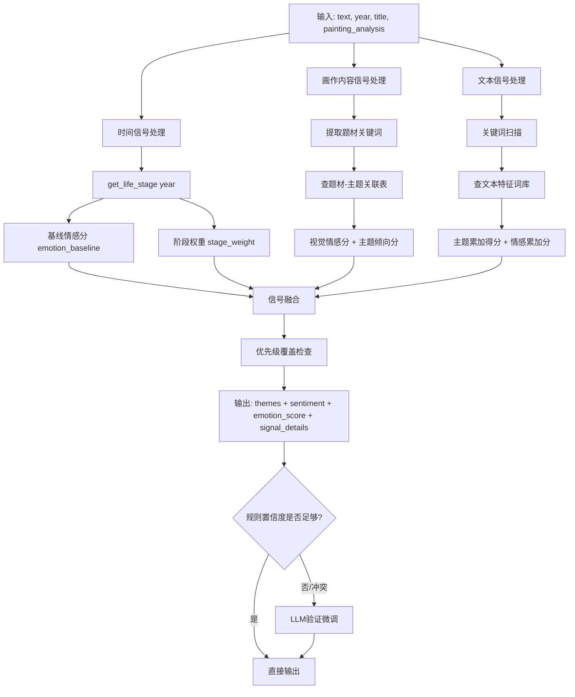

## 产品概述

将李鱓题跋主题/情感分类系统从纯LLM提示词驱动升级为"时间信号+画作内容信号+文本信号"三维融合的规则引擎算法，实现客观、可复现、可解释的分类体系。

## 核心功能

- **时间信号处理**：将创作年份映射为4期人生阶段（早期/被贬期/再起再落期/归隐期），每期带基线情感权重(1.0-2.0)，当文本情感模糊时用阶段权重修正
- **画作内容信号处理**：从画作标题和AI画材分析文本中提取题材关键词，映射为5类视觉情感倾向（傲骨坚韧/富贵长寿/萧瑟压抑/生活趣味/谐音吉祥），每类带证据权重(1.0-1.5)和默认主题倾向
- **文本信号增强**：将现有关键词匹配升级为权重打分累加，增加优先级覆盖规则（讽喻得分>=3直接锁定、短文本强制记录等）
- **三维信号融合**：综合时间基线+画作内容得分+文本关键词得分，输出最终主题排序和连续情感分值(emotion_score)
- **LLM降级为验证角色**：规则引擎为主分类器，LLM仅在边界case或规则冲突时介入微调
- **新增painting_analysis字段**：数据库新增字段存储AI画材分析文字，作为画作内容信号的输入源
- **分类结果可解释**：content_analysis JSON中保存各维度信号得分明细，便于回溯和验证

## 技术栈

- 后端框架：Python + FastAPI（延续现有）
- 数据库：SQLite（延续现有 calligraphy.db）
- NLP：jieba分词（延续现有）
- LLM：Qwen Turbo（降级为辅助验证角色）

## 实现方案

### 核心架构：三维度信号融合引擎



### 关键技术决策

1. **新建独立分类器模块**而非修改现有文件：v4分类器逻辑复杂（3张规则表+融合算法+优先级覆盖），放在独立文件中便于测试和迭代，不影响现有v3逻辑
2. **规则表用Python常量定义**而非JSON配置文件：规则表与代码紧耦合，Python dict更灵活（支持列表匹配、函数引用），且当前数据量小无需外部配置
3. **painting_analysis字段新增**：用户明确提到已有AI画材分析文字，但数据库无对应字段，需新增TEXT列存储
4. **LLM降级但保留**：规则引擎覆盖80%+场景，LLM仅在规则置信度不足或信号冲突时介入，避免完全移除LLM能力
5. **emotion_score连续值**：保留-3到+3的连续情感分值，用于未来时间序列分析（心境起伏曲线）

### 数据流改造

**当前**：`text → rule_based_theme(text) + llm_v3(text) → 融合(LLM为主)`
**目标**：`(text, year, title, painting_analysis) → v4_signal_fusion() → 规则为主 → [可选]LLM验证`

### 目录结构

```
backend/
├── app/
│   ├── services/
│   │   ├── inscription_classifier_v4.py  # [NEW] v4多维信号融合分类器核心模块
│   │   ├── inscription_content_analyzer.py  # [MODIFY] 集成v4分类器，扩展analyze_tiba_content_dual签名
│   │   └── ...
│   ├── api/
│   │   ├── content_analysis.py  # [MODIFY] batch_analyze/reclassify传入year/title/painting_analysis
│   │   └── ...
│   ├── models/
│   │   └── tubi_analysis.py  # [MODIFY] 新增painting_analysis字段
│   └── ...
├── migrations/
│   └── add_painting_analysis.py  # [NEW] 数据库迁移：添加painting_analysis列
└── _test_v4_classifier.py  # [NEW] v4分类器单元测试脚本
```

### 各文件详细说明

**[NEW] `app/services/inscription_classifier_v4.py`**

- 定义3张规则表常量：
- `LIFE_STAGE_RULES`：年份范围→人生阶段→基线情感→阶段权重
- `MATERIAL_THEME_RULES`：题材关键词→视觉情感→默认主题倾向→证据权重
- `TEXT_SCORING_RULES`：主题→触发关键词→得分→优先级/互斥规则
- 实现`get_life_stage(year)`：4期划分（1715-1724/1725-1734/1735-1744/1745-1760）
- 实现`classify_by_time_signal(year)`：返回基线情感分和阶段权重
- 实现`classify_by_painting_signal(title, painting_analysis)`：从标题+画材分析提取题材关键词，查表返回主题倾向分和视觉情感分
- 实现`classify_by_text_signal(text)`：增强版关键词打分，支持累加+优先级覆盖
- 实现`classify_inscription_v4(text, year, title, painting_analysis)`：三维信号融合主函数，返回themes/sentiment/emotion_score/signal_details
- 实现`should_consult_llm(result)`：判断是否需要LLM介入验证

**[MODIFY] `app/services/inscription_content_analyzer.py`**

- `analyze_tiba_content_dual()`签名扩展：`text` → `(text, year=None, title=None, painting_analysis=None)`
- 内部调用`classify_inscription_v4()`替代当前`llm_theme_classification_v3()`作为主分类器
- 保留LLM v3作为验证通道（当规则置信度不足时调用）
- `AnalysisResult`新增`signal_details`字段保存各维度信号明细
- `get_period_phase()`保留兼容，v4内部使用新的`get_life_stage()`

**[MODIFY] `app/api/content_analysis.py`**

- `batch_analyze()`：SQL查询增加`title`列，`process_record()`传入year/title给分类函数
- `reclassify_themes_sentiment()`：SQL查询增加`year, title`列，分类逻辑改为先调v4规则引擎，再可选调LLM验证
- 两处API的`content_analysis` JSON输出增加`signal_details`和`emotion_score`字段

**[MODIFY] `app/models/tubi_analysis.py`**

- 新增`painting_analysis = Column(Text, comment="AI画材分析文字")`字段

**[NEW] `migrations/add_painting_analysis.py`**

- ALTER TABLE添加painting_analysis列

**[NEW] `_test_v4_classifier.py`**

- 用已知记录测试v4分类器，对比v3结果，验证改进效果

## SubAgent

- **code-explorer**
- Purpose: 深入探索现有分类逻辑的边界case和数据库中year/title的实际数据质量
- Expected outcome: 确认year字段覆盖率、title字段内容特征、现有content_analysis JSON中可复用的信号数据