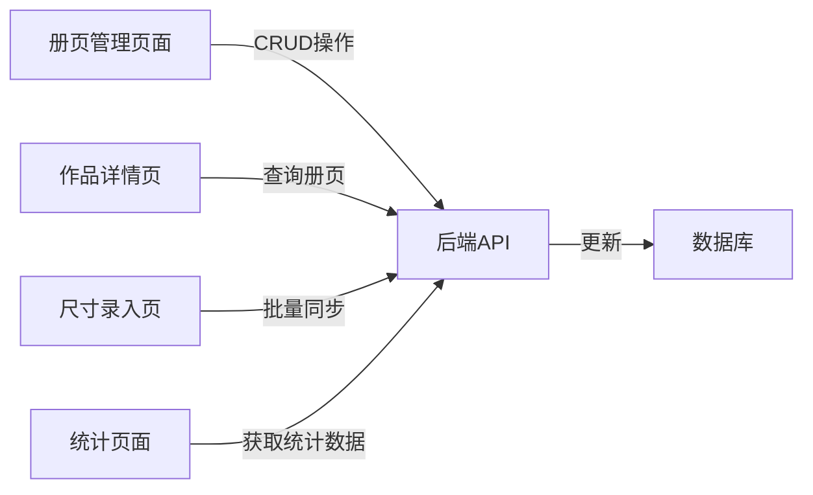

## 产品概述

册页功能系统化管理，针对成套册页作品（如《花鸟册页十开》）提供完整的管理、展示、尺寸同步和统计功能。

## 核心功能

- **前端作品详情页**：右侧原作卡片图片下方显示册页内其他作品缩略图，左右箭头切换，点击跳转
- **册页管理后台**：简易管理系统，支持创建册页、添加/删除作品、调整页码顺序
- **尺寸录入优化**：册页作品显示在子集，编辑一幅画尺寸自动同步到其他画
- **统计功能**：册页算在小幅作品里，同时显示册页包含多少份作品

## 技术栈

- **后端**：FastAPI + SQLite（现有技术栈）
- **前端**：Vue 3 + Element Plus（现有技术栈）
- **数据库**：利用现有 `album_name` 和 `album_index` 字段

## 架构设计

### 后端 API 设计

- 新增册页管理 API 模块（在 tubi.py 中扩展）
- 扩展统计 API 支持册页统计
- 复用现有的尺寸批量 API

### 前端模块划分

- **册页管理页面**：AlbumManager.vue（新建）
- **作品详情页增强**：TubiAnalysis.vue（修改）
- **路由配置**：添加册页管理路由

### 数据流程



## 目录结构

```
project-root/
├── backend/
│   └── app/api/
│       └── tubi.py  # [MODIFY] 新增册页管理 API，扩展统计 API
└── frontend/src/
    ├── views/
    │   ├── AlbumManager.vue  # [NEW] 册页管理页面
    │   ├── TubiAnalysis.vue  # [MODIFY] 添加册页内作品导航
    │   └── DimensionInput.vue  # [MODIFY] 优化册页尺寸同步体验
    └── router/
        └── index.js  # [MODIFY] 添加册页管理路由
```

## 设计风格

采用与现有系统一致的中国传统书画美学风格，融合现代交互设计。使用浅米色背景、朱红色强调、精致的边框和阴影，营造雅致的学术氛围。

## 页面规划

### 1. 册页管理页面

- **顶部工具栏**：搜索框、新建册页按钮
- **册页列表**：卡片式布局，每个册页显示封面缩略图、名称、作品数量
- **册页详情面板**：右侧滑出，显示册页内作品列表，支持拖拽排序
- **作品选择器**：弹窗形式，支持多选作品加入册页

### 2. 作品详情页册页导航

- **位置**：右侧原作卡片图片下方
- **布局**：水平滚动条，显示缩略图网格
- **交互**：左右箭头快速切换，点击缩略图跳转，显示当前页码/总页数

## 单页区块设计

### 册页管理页面主要区块

1. **页头区域**：页面标题、操作按钮、统计概览
2. **册页列表区**：网格布局展示所有册页，带筛选和排序
3. **侧滑详情面板**：册页作品管理、拖拽排序、批量操作
4. **作品选择弹窗**：待选作品列表、搜索筛选、确认添加

### 作品详情页册页导航区块

1. **册页信息栏**：册页名称、当前位置（如"第3开/共10开"）
2. **缩略图导航条**：水平滚动，当前作品高亮
3. **快捷操作**：上一页/下一页按钮，快速跳转