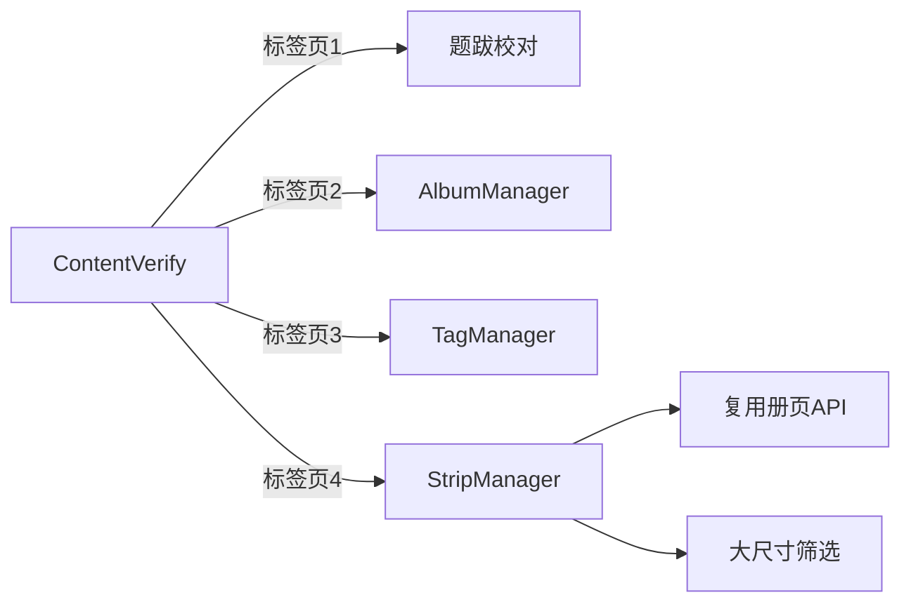

## 需求概述

1. 在校对页面整合册页管理、标签管理功能，作为统一管理后台入口
2. 复制册页管理功能，新增条屏管理（针对大尺寸作品）
3. 确认册页导航功能状态

## 产品功能

- ContentVerify 页面重构为标签页布局，包含：题跋校对、册页管理、标签管理、条屏管理
- 条屏管理：与册页管理功能相同，但只显示和管理大尺寸作品
- 统一管理后台，方便用户一站式操作

## 视觉效果

- 使用 Element Plus el-tabs 标签页切换
- 各标签页保持原有设计风格
- 条屏管理文案与册页管理区分

## 技术方案

### 前端技术栈

- Vue 3 + TypeScript
- Element Plus 组件库
- 现有项目架构复用

### 实现策略

#### 1. ContentVerify 重构

- 添加 el-tabs 组件，4个标签页：
- 题跋校对（原有功能）
- 册页管理（AlbumManager 组件）
- 标签管理（TagManager 组件）
- 条屏管理（新建 StripManager 组件）

#### 2. 条屏管理开发

- 复制 AlbumManager.vue 创建 StripManager.vue
- 修改筛选逻辑：通过 artwork_width_cm/artwork_height_cm 判断大尺寸作品
- 复用册页管理 API（逻辑完全相同）
- 调整文案：册页→条屏，开→幅

#### 3. 后端支持

- 复用现有册页管理 API
- 可选：添加条屏专用统计接口

#### 4. 路由配置

- 保持现有路由不变
- /content-verify 作为统一管理后台入口

### 架构设计



### 目录结构

```
frontend/src/views/
├── ContentVerify.vue    # [MODIFY] 添加标签页，整合各管理模块
├── AlbumManager.vue     # [复用] 册页管理组件
├── TagManager.vue       # [复用] 标签管理组件
└── StripManager.vue     # [NEW] 条屏管理组件（复制AlbumManager）
```

## 设计风格

采用 Element Plus 默认设计风格，与现有页面保持一致，使用标签页切换提供清晰的功能分区。

## 页面布局

- 顶部：页面标题 + 统计标签
- 中间：el-tabs 标签页组件
- 各标签页内容：保持原有组件设计