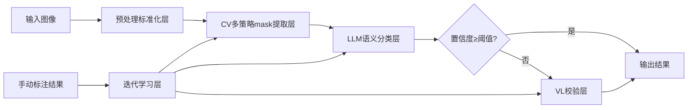

## 产品概述

重构题跋分析系统为泛化优先的CV-First架构，解决现有方案过拟合、仅对亮底画有效、暗底/偏黄/有污渍画作失效的问题。核心流程为CV精确mask提取→LLM语义分类→VL校验兜底，遵循准确性优先原则，支持自动迭代优化，适配所有类型的画作输入。

## 核心功能

1. 输入预处理标准化层：统一处理光照校准、颜色归一化、噪声过滤、分辨率归一化，消除底色/扫描差异
2. CV多策略mask提取：全相对阈值体系，无硬编码固定阈值，自适应不同画作特征
3. LLM语义分类器：按画群（暗底/亮底/彩色/单色等）注入对应规律，输出分类结果和置信度
4. VL校验层：低置信度结果自动触发VL校验兜底，保证准确性
5. 迭代学习机制：支持实时学习手动标注结果，定期批量优化，内置强制跨群测试机制
6. 全兼容现有系统：无缝集成到tubi_worker主流程，不影响其他功能

## 技术栈

- 沿用现有技术栈：Python 3.9+ + FastAPI + OpenCV 4.x + DashScope Qwen API
- 无新增第三方依赖，保证兼容性
- 数据库：现有SQLite，新增画群规律表和评估记录表

## 架构设计

### 分层架构



### 核心设计原则

1. 绝对特征全禁用：所有阈值、特征均基于当前图像统计值计算，无硬编码固定值
2. 画群隔离：规律按画群分类存储，互不干扰，新图自动匹配对应画群
3. 泛化性强制校验：每次优化必须通过跨群测试和基准测试集验证
4. 兼容现有接口：输入输出完全兼容原有API，无需修改前端和其他模块

## 目录结构

```
z:/BaiduSync/BaiduSyncdisk/calligraphy-recognition/backend/app/
├── tubi/
│   ├── preprocessing/             # [NEW] 预处理标准化模块
│   │   ├── __init__.py
│   │   ├── standardizer.py        # 标准化核心实现：CLAHE/颜色归一化/噪声过滤
│   │   └── group_classifier.py    # 画群分类器：自动判断画作所属群
│   ├── cv_mask_extractor/         # [NEW] CV多策略mask提取模块
│   │   ├── __init__.py
│   │   ├── ink_mask.py            # 墨迹mask提取（相对局部均值）
│   │   ├── seal_mask.py           # 印章mask提取（相对全图主色）
│   │   ├── text_mask.py           # 文字区域mask提取（相对周期性）
│   │   ├── texture_mask.py        # 纹理密度mask提取（相对密度排名）
│   │   └── connected_mask.py      # 连通域分类mask提取（相对面积/长宽比）
│   ├── llm_classifier/            # [NEW] LLM语义分类模块
│   │   ├── __init__.py
│   │   ├── prompt_templates/      # 分群prompt模板
│   │   ├── classifier.py          # 分类核心逻辑
│   │   └── rule_library.py        # 分群规律库
│   ├── vl_verifier/               # [NEW] VL校验模块
│   │   ├── __init__.py
│   │   ├── cropper.py             # 低置信度区域裁切
│   │   └── verifier.py            # VL校验逻辑
│   ├── learning_loop/             # [NEW] 迭代学习模块
│   │   ├── __init__.py
│   │   ├── realtime_learner.py    # 实时学习手动标注
│   │   ├── batch_optimizer.py     # 批量优化规律
│   │   └── cross_group_tester.py  # 跨群测试框架
│   └── tubi_worker.py             # [MODIFY] 集成新流程到主函数
└── data/
    ├── baseline/                  # [NEW] 103张标注数据基线库
    ├── rule_library/              # [NEW] 分群规律库存储
    └── test_sets/                 # [NEW] 基准测试集（5张特殊画）
```

## 实现要点

1. 预处理层：CLAHE局部直方图均衡化参数自适应，颜色归一化基于标准宣纸色彩模板匹配
2. 相对阈值计算：所有阈值基于当前图像的均值、标准差、百分位等统计值动态计算
3. 画群分类：基于亮度中位数、色彩饱和度、纹理复杂度三个特征自动聚类
4. 跨群测试：每次批量优化自动拆分80%训练集/20%测试集，验证IoU下降不超过10%

## Agent扩展

### SubAgent

- **code-explorer**
- Purpose：探索现有tubi_worker.py和相关模块的代码结构，明确集成点和接口规范
- Expected outcome：梳理出所有需要修改的文件位置，确保新模块与现有系统无缝集成