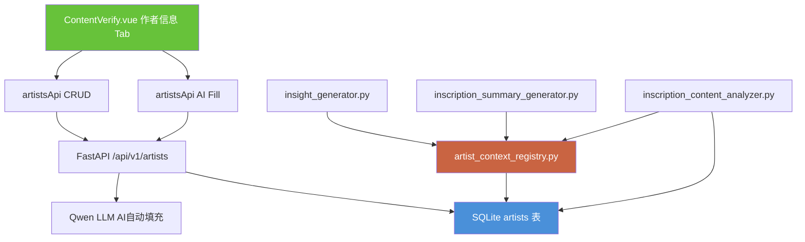

## 产品概述

在管理后台新增「作者信息」标签页，将当前分散硬编码在6个Python文件中的画家元数据和LLM提示词变量统一迁移至数据库 `artists` 表，提供可视化编辑界面。新增画家时支持 AI 一键查询自动填充生平背景和提示词。

## 核心功能

1. **数据库表与迁移**：新建 `artists` 表（name, birth_year, background, sentiment_note, theme_note, theme_aliases, keyword_rules, specialties, enabled），将6位画家全部元数据从代码迁移入库
2. **后端 CRUD API**：列表查询、新建、编辑、删除画家信息的 RESTful 端点
3. **AI 自动填充**：新增画家时调用 LLM 搜索其公开信息，自动填充出生年份、生平背景、艺术风格、代表作品、关键人生节点，并基于生平推断初始 sentiment_note/theme_note
4. **代码重构**：`artist_context_registry.py` 和 `inscription_content_analyzer.py` 从读Python字典改为读数据库，对上层调用透明
5. **前端编辑界面**：ContentVerify.vue 新增「作者信息」Tab，表格展示所有画家，点击进入编辑弹窗，含「AI一键查询」按钮

## 视觉效果

- Tab 页表格展示画家列表：姓名、出生年份、是否启用、操作按钮
- 编辑弹窗包含：基本信息区（姓名/出生年份/启用开关）、背景信息区（长篇Markdown编辑器）、提示词变量区（sentiment_note/theme_note/别名/关键词规则JSON/专长JSON）
- 新建画家弹窗顶部有醒目的「AI 一键查询」按钮，填入画家名后点击即可自动填充

## 技术栈

- 后端：Python FastAPI + SQLite（raw sqlite3，复用 `get_db_connection()` 模式）
- 前端：Vue 3 + Element Plus
- 数据迁移：独立 Python 脚本（复用 `backend/migrations/` 模式）
- LLM：Qwen3.5-plus（AI 自动填充，复用现有 `siliconflow_service.py` 调用模式）

## 实现方案

### 整体策略

**数据层**：新建 `artists` 表，使用 raw sqlite3 而非 SQLAlchemy ORM，与 `content_analysis.py` 中16个API端点的模式一致。同时创建 SQLAlchemy 模型供未来拓展使用。

**API层**：新建 `backend/app/api/artists.py`，注册为独立路由 `/api/v1/artists`。所有查询使用 `get_db_connection()` 连接 SQLite。

**重构策略**：`artist_context_registry.py` 的 `get_artist_context()`、`get_artist_birth_year()` 函数改为从数据库读取，缓存到模块级字典（首次加载 + 写操作后刷新），对 `insight_generator.py`、`inscription_summary_generator.py` 等调用方完全透明。

**提示词变量注入**：`inscription_content_analyzer.py` 的 `_get_artist_sentiment_note()` 和 `_get_artist_theme_note()` 从 DB 查询对应字段，消除 `if name == "李鱓"` 硬编码分支。

### 关键性能决策

- **缓存策略**：`artist_context_registry.py` 使用模块级 `_cache` 字典 + `_cache_ttl`，写操作后主动刷新，避免每次 LLM 调用都查库
- **迁移幂等**：迁移脚本先检查表/数据是否存在，可重复运行
- **关键词规则存储**：JSON TEXT 字段，单画家可配置多组规则 `[{"trigger":["老夫"],"context":["寒","难","苦"],"target_theme":3,"boost":2}]`

## 架构设计

### 系统架构



### 数据流

```
前端编辑/查询 → GET/POST/PUT /api/v1/artists → SQLite CRUD → 返回JSON
AI自动填充 → POST /api/v1/artists/ai-fill → Qwen LLM → 返回填充结果 → 前端展示确认
LLM分析调用 → get_artist_context() → 读取内存缓存 → 返回背景文本注入提示词
```

## 目录结构

```
backend/
├── app/
│   ├── api/
│   │   └── artists.py              # [NEW] 画家信息 CRUD + AI 自动填充 API
│   ├── models/
│   │   ├── artist.py               # [NEW] SQLAlchemy Artist 模型
│   │   └── __init__.py             # [MODIFY] 注册 Artist 模型
│   └── services/
│       ├── artist_context_registry.py  # [MODIFY] 重构为从DB读取
│       └── inscription_content_analyzer.py # [MODIFY] _get_artist_sentiment_note/_theme_note 重构
├── migrations/
│   └── create_artists_table.py     # [NEW] 建表 + 数据迁移脚本
└── main.py                         # [MODIFY] 注册 artists 路由

frontend/
└── src/
    ├── api/
    │   └── index.js                # [MODIFY] 新增 artistsApi
    └── views/
        └── ContentVerify.vue       # [MODIFY] 新增「作者信息」Tab
```

## 关键代码结构

### artists 表 Schema

```sql
CREATE TABLE IF NOT EXISTS artists (
    id INTEGER PRIMARY KEY AUTOINCREMENT,
    name VARCHAR(100) NOT NULL UNIQUE,
    birth_year INTEGER,
    background TEXT,
    sentiment_note TEXT,
    theme_note TEXT,
    theme_aliases VARCHAR(500),
    keyword_rules TEXT,     -- JSON: [{"trigger":["老夫"],"context":["寒"],"target_theme":3,"boost":2}]
    specialties TEXT,        -- JSON: ["破笔泼墨","用水有法"]
    enabled INTEGER DEFAULT 1,
    created_at TEXT DEFAULT (datetime('now','localtime')),
    updated_at TEXT DEFAULT (datetime('now','localtime'))
);
```

### artist_context_registry.py 重构接口（不变）

```python
def get_artist_context(artist_name: str) -> str:
    """从数据库读取画家背景上下文，未找到返回通用模板"""
    
def get_artist_birth_year(artist_name: str) -> Optional[int]:
    """从数据库读取画家出生年份"""

def get_artist_display_name(artist_name: str) -> str:
    """去除朝代前缀，保持不变"""
```

### AI 自动填充 Prompt 模板

```
你是一位中国艺术史研究专家。请为我查询并整理画家「{name}」的详细信息，用严格的JSON格式返回：
{
  "birth_year": 整数,
  "background": "Markdown格式的生平背景（200-400字），包含画家简介、教育经历、艺术特色、代表作品、重要展览、艺术主张、关键人生节点对创作风格的影响",
  "sentiment_note": "一句话提示词，用于LLM情感分析时提醒该画家的特殊情感表达习惯（如未知则填空字符串）",
  "theme_note": "一句话提示词，用于LLM主题分析时提醒该画家的特殊主题表达习惯和易混淆情形（如未知则填空字符串）",
  "theme_aliases": "画家别名，逗号分隔（如未知则填空字符串）",
  "specialties": ["构图专长标签1","标签2"]
}
只返回JSON，不要其他内容。
```