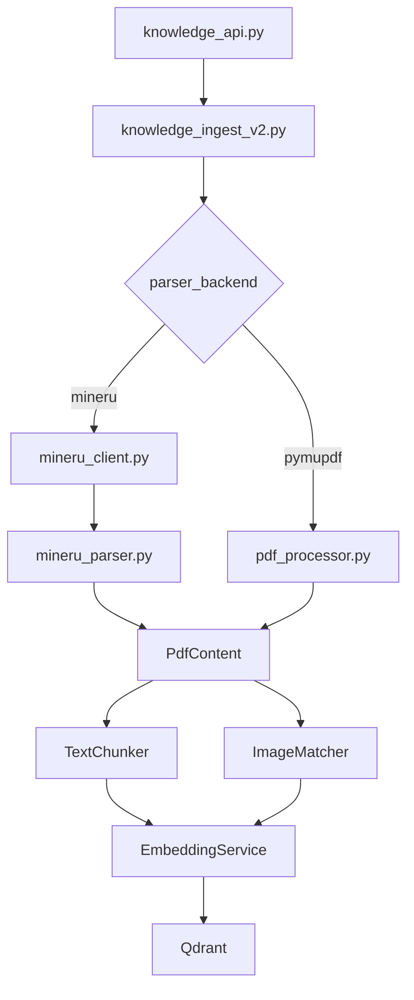

## 需求概述

将 MinerU 云 API 集成到知识库 PDF 解析流程中，替代现有的 PyMuPDF 本地解析器。保持 `PdfContent` 接口不变，下游代码无需修改。

## 核心改动

1. **新建 `mineru_client.py`** — MinerU 云 API 客户端（上传、轮询、下载）
2. **新建 `mineru_parser.py`** — 将 MinerU 输出转换为 PdfContent 格式
3. **修改 `knowledge_ingest_v2.py`** — 支持选择 parser_backend（mineru/pymupdf）
4. **修改 `knowledge_api.py`** — 上传接口新增 parser_backend 参数

## 技术方案

### 架构设计

```
用户上传 PDF → knowledge_api.py (parser_backend 参数)
    → KnowledgeIngestV2.process_pdf()
        ├─ parser_backend="mineru" → MinerUClient → MineruParser → PdfContent
        └─ parser_backend="pymupdf" → PdfProcessor → PdfContent (现有逻辑)
    → 文本分块 → 向量化 → 图像处理 → 关联映射 (不变)
```

### MinerU API 调用流程

```
1. POST /api/v4/file-urls/batch → 获取 batch_id + upload_url
2. PUT upload_url → 上传本地 PDF 到 OSS
3. GET /api/v4/extract-results/batch/{batch_id} → 轮询状态（每3秒）
4. state=done → 下载 full_zip_url → 解压获取 content_list.json + images/
```

### PdfContent 转换逻辑

| MinerU 字段 | PdfContent 字段 | 转换规则 |
| --- | --- | --- |
| type="text" + text | ExtractedText.content | 直接映射 |
| page_idx | ExtractedText.page | +1 转为 1-based |
| type="image" + img_path | ExtractedImage.image_data | 从 zip 中读取图片文件 |
| bbox | ExtractedImage.bbox | 转换为 {x0, y0, x1, y1} |
| type="title" | chapter_title | 标记为章节标题 |


### 关键设计决策

1. **保持 PdfContent 接口不变** — MinerU 解析结果转换为相同的 PdfContent 格式，下游代码无需修改
2. **策略模式** — `parser_backend` 参数控制使用哪个解析器
3. **PyMuPDF 保留为 fallback** — 当 MinerU API 不可用时自动降级
4. **异步支持** — MinerU API 调用是异步的（上传→轮询→下载），在 async 上下文中运行
5. **配置化** — 从 .env 读取 MINERU_API_TOKEN, MINERU_API_BASE, MINERU_MODEL_VERSION

## 文件变更

### 新增文件

- `backend/app/modules/pantianshou_composition/mineru_client.py` — MinerU 云 API 客户端
- `backend/app/modules/pantianshou_composition/mineru_parser.py` — MinerU 输出转 PdfContent

### 修改文件

- `backend/app/modules/pantianshou_composition/knowledge_ingest_v2.py` — 新增 parser_backend 参数
- `backend/app/modules/pantianshou_composition/knowledge_api.py` — 上传接口新增 parser_backend 字段

## Tech Stack

- **后端框架**: FastAPI (Python)
- **PDF 解析**: MinerU 云 API (vlm 模型) + PyMuPDF (fallback)
- **向量库**: Qdrant
- **数据库**: SQLite (SQLAlchemy ORM)
- **配置管理**: python-dotenv (.env)

## 技术架构

### 模块关系



### 数据流

1. **MinerU 路径**: PDF → MinerU API → Zip(content_list.json + images/) → MineruParser → PdfContent
2. **PyMuPDF 路径**: PDF → PdfProcessor → PdfContent (现有逻辑)
3. **共同路径**: PdfContent → TextChunker → EmbeddingService → Qdrant

### 关键接口

#### MinerUClient

```python
class MinerUClient:
    async def parse_pdf(self, pdf_path: str) -> MineruResult:
        """完整流程：上传 → 轮询 → 下载 → 解析"""
        batch_id, upload_url = await self.request_upload_url(pdf_path)
        await self.upload_file(upload_url, pdf_path)
        result = await self.poll_result(batch_id)
        return await self.download_and_parse(result)
```

#### MineruParser

```python
class MineruParser:
    def parse(self, zip_path: str) -> PdfContent:
        """将 MinerU zip 结果转换为 PdfContent"""
        # 解析 content_list.json
        # 提取 images/
        # 转换为 ExtractedText / ExtractedImage
```

### 配置项

```
MINERU_API_TOKEN=eyJ0eXBlIjoiSldUIi...
MINERU_API_BASE=https://mineru.net
MINERU_MODEL_VERSION=vlm
```

### 错误处理

1. **API 超时**: 轮询超过 300 秒自动失败
2. **网络错误**: 指数退避重试（最多 3 次）
3. **解析失败**: 自动降级到 PyMuPDF
4. **Token 过期**: 抛出明确错误提示用户更新 Token

## Agent Extensions

无 — 当前任务不涉及已列出的扩展