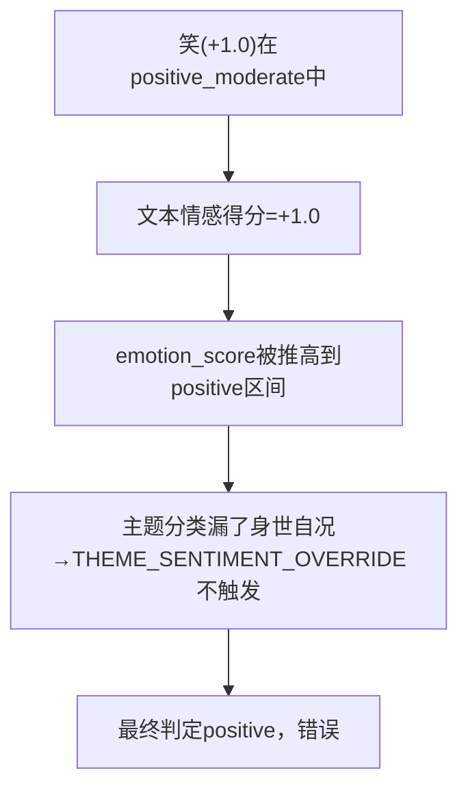

# 自嘲模式情感反转方案

## 问题分析

### 两条作品对比

| 项目      | 237f2c9e（修复前）                                  | 06473a9f（LLM已修正）                   |
| ------- | ---------------------------------------------- | ---------------------------------- |
| 题跋      | 莫笑田家老瓦盆，也分秋色到柴门。西风昨夜园林过，扶起霜花扣竹根。雍正八年中冬，懊道人李鱓写。 | 莫笑田家老瓦盆，也分秋色到柴门。西风昨夜园林过，扶起霜花扣竹根。李鱓 |
| 当前主题    | 咏物寄兴,吉语祥瑞,交游赠答（**完全错误**）                       | 身世自况,咏物寄兴（✅ 正确，LLM修正后）             |
| 当前情感    | positive (+1.63) **错误**                        | negative (-3.0) **正确**             |
| 触发LLM修正 | ❌ 未触发（规则引擎置信度过高）                               | ✅ 已触发（低置信度→LLM复核改判）                |

### 问题根因



1. **"笑"被无条件视为正向情感词**：`EMOTION_SCORING.positive_moderate` 中"笑"→+1.0。但在"莫笑田家老瓦盆"中，这是**自嘲（self-deprecation）**，不是真正的高兴。
2. **自嘲模式未纳入身世自况关键词**：`THEMES[1]`（身世自况）关键词缺少"莫笑""堪笑"等自嘲模式，导致主题分类把咏物寄兴/吉语祥瑞排在第一。
3. **主题错误→情感覆盖不触发**：身世自况的 THEME\_SENTIMENT\_OVERRIDE（压制到 <= -1.5 + 额外 -1.0 bonus）因为主题分类没识别出身世自况而不触发。
4. **237f2c9e 因落款较长导致置信度偏高**：LLM 修正未被触发，错误固化。

***

## 解决方案：三层自嘲检测机制

### Layer 1: 情感词表 — EMOTION\_SCORING 补充自嘲情感项

**改动文件**：`tibi_analysis_rules.py`

新增负面情感类别 `negative_self_mock`：

```
"negative_self_mock": {"words": ["莫笑", "堪笑", "自笑", "一笑", "休笑", "人笑", "应笑", "可笑"], "score": -1.5}
```

* "莫笑田家老瓦盆" → `"莫笑" in text` → -1.5

* text\_emotion\_score = "笑"(+1.0) + "莫笑"(-1.5) = **-0.5** ← 整体中性偏负

* 如果再配合时间/画家底色修正，就进入 negative 区间

### Layer 2: 主题关键词 — TEXT\_SCORING\_RULES 补充自嘲模式

**改动文件**：`tibi_analysis_rules.py`
**改动位置**：`TEXT_SCORING_RULES[1]`（身世自况）的 keywords

新增：

```
"莫笑":3, "堪笑":3, "自笑":2, "一笑":2, "休笑":2, "人笑":2, "应笑":2, "可笑":2
```

* "莫笑" score=3（强信号）：确保"莫笑田家老瓦盆"的主题得分中身世自况排第一

* 其他模式 score=2（中等信号）

### Layer 3: 信号融合 — classify\_inscription\_v4 增加自嘲检测后处理

**改动文件**：`inscription_content_analyzer.py`

在 `score_text_keywords()` 函数中，在原有的 emotion\_score 累加循环**之后**，添加自嘲后处理逻辑：

```python
# 自嘲检测：反转"笑"在自嘲语境下的正向贡献
SELF_MOCK_PATTERNS = ["莫笑", "堪笑", "自笑", "一笑", "休笑", "人笑", "应笑", "可笑"]
has_self_mock = any(p in text for p in SELF_MOCK_PATTERNS)
if has_self_mock and "笑" in text:
    # 统计 emotion_details 中来自"笑"的正向贡献
    mock_adjustment = 0
    remaining_details = []
    for det in emotion_details:
        if det["word"] == "笑":
            # 自嘲语境下的"笑"：不贡献正向，改为负向
            mock_adjustment += det["score"]  # 减掉原有的 +1.0
            remaining_details.append({
                "word": "笑(自嘲)",
                "score": -1.5,  # 追加自嘲贡献
                "category": "negative_self_mock",
            })
        else:
            remaining_details.append(det)
    emotion_score -= sum(d["score"] for d in emotion_details if d["word"] == "笑")
    emotion_score += -1.5 * len([d for d in emotion_details if d["word"] == "笑"])
    emotion_details = remaining_details
```

等效更简洁的实现：

```python
# 自嘲语境下的"笑"：从情感分中扣除原有的正向贡献，追加自嘲负向贡献
SELF_MOCK_PATTERNS = ["莫笑", "堪笑", "自笑", "一笑", "休笑", "人笑", "应笑", "可笑"]
has_self_mock = any(p in text for p in SELF_MOCK_PATTERNS)
if has_self_mock:
    for det in emotion_details:
        if det["word"] == "笑":
            emotion_score -= det["score"]  # 移除"笑"的 +1.0
            emotion_score += -1.5  # 追加自嘲 -1.5
            det["score"] = -1.5  # 更新明细
            det["word"] = "笑(自嘲)"
            det["category"] = "negative_self_mock"
```

这样 emotion\_details 中的显示变为：

```
题跋中出现 "笑(自嘲)"(-1.5)
```

***

## 预期效果

### 237f2c9e（修复后）

* 文本情感计算："笑"(+1.0) 被自嘲检测反转 → +1.0 - 1.0 - 1.5 = **-1.5**

* 主题得分：身世自况 + "莫笑"(+3) = 排名第一

* 主题-情感关联触发：身世自况的 override\_bonus(-1.0)，min\_score ≤ -1.5

* 最终情感：**negative** ✅

### 06473a9f（修复后）

* 同样的逻辑，但不依赖 LLM 修正

* 规则引擎自身置信度提高（身世自况被正确识别且情感正确）

* 最终情感：**negative** ✅

***

## 实施方案

### 修改1：EMOTION\_SCORING 新增 negative\_self\_mock 类别

**文件**：`backend/app/services/tibi_analysis_rules.py`
**位置**：第39行 `EMOTION_SCORING` 字典
**操作**：新增 negative\_self\_mock 条目

### 修改2：TEXT\_SCORING\_RULES\[1] 自嘲关键词

**文件**：`backend/app/services/tibi_analysis_rules.py`
**位置**：第37行 `TEXT_SCORING_RULES[1].keywords`
**操作**：追加自嘲模式关键词

### 修改3：score\_text\_keywords() 自嘲后处理

**文件**：`backend/app/services/inscription_content_analyzer.py`
**位置**：第239-276行 `score_text_keywords()`
**操作**：在 emotion\_score 计算循环之后添加自嘲检测后处理

### 修改4：RULES\_VERSION 递增

**文件**：`backend/app/services/tibi_analysis_rules.py`
**位置**：第6行 `RULES_VERSION`
**操作**：5.6 → 5.7

### 验证

1. 分别对 237f2c9e 和 06473a9f 两条执行本地规则引擎重新分析
2. 验证：

   * 主题第一为"身世自况"

   * 情感极性为 negative

   * 文本情感步骤显示包含"笑(自嘲)"(-1.5)

   * 置信度 ≥ 0.6（不依赖 LLM 修正即可正确判定）

***

## 执行清单

| # | 任务                                       | 文件                                | 状态  |
| - | ---------------------------------------- | --------------------------------- | --- |
| 1 | EMOTION\_SCORING 新增 negative\_self\_mock | tibi\_analysis\_rules.py          | 待执行 |
| 2 | TEXT\_SCORING\_RULES\[1] 补充自嘲关键词         | tibi\_analysis\_rules.py          | 待执行 |
| 3 | score\_text\_keywords() 自嘲后处理逻辑          | inscription\_content\_analyzer.py | 待执行 |
| 4 | RULES\_VERSION 递增                        | tibi\_analysis\_rules.py          | 待执行 |
| 5 | 重新分析 237f2c9e 并验证                        | 验证                                | 待执行 |
| 6 | 重新分析 06473a9f 并验证                        | 验证                                | 待执行 |

